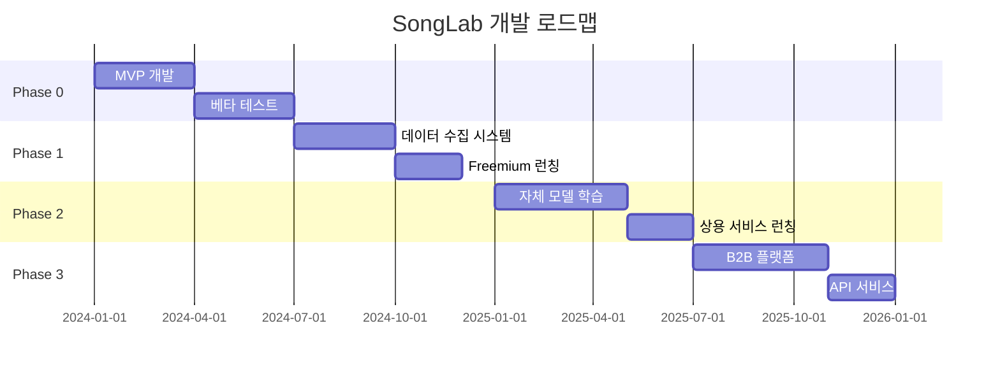

# SongLab 사업계획서
### AI 기반 보컬 분석 플랫폼

---

## 1. Executive Summary

### 회사 개요
- **회사명**: SongLab (송랩)
- **설립일**: 2024년 (예정)
- **대표자**: [대표명]
- **사업 분야**: AI 보컬 분석 SaaS, 음악 교육 기술
- **비전**: "모든 사람이 자신의 목소리를 이해하고 발전시킬 수 있는 세상"

### 핵심 가치 제안
보컬 전문가가 직접 개발한 AI 기반 보컬 분석 시스템으로, 일반인부터 전문가까지 객관적이고 정확한 보컬 진단 및 맞춤형 개선 솔루션을 제공합니다.

### 핵심 경쟁력
1. **도메인 전문성**: 현직 보컬 전문가가 직접 설계한 분석 알고리즘
2. **기술 자립도**: 1인 풀스택 개발로 빠른 의사결정과 개발
3. **비용 효율성**: 외주 없이 자체 개발로 초기 투자 최소화
4. **확장 가능성**: B2C에서 B2B까지 단계적 확장 전략

---

## 2. 시장 분석

### 2.1 목표 시장 규모

#### 국내 시장
```
1차 시장 (B2C - 취미생)
- 노래방 이용 인구: 3,000만명
- 음악 학원 수강생: 200만명
- 목표 점유율: 3% (90만명)
- 예상 매출: 연 108억원 (월 1만원 × 90만명)

2차 시장 (B2B - 전문가)
- 보컬 학원: 5,000개
- 보컬 트레이너: 20,000명
- 기획사/프로덕션: 500개
- 예상 매출: 연 60억원
```

#### 글로벌 시장
```
- 글로벌 음악 교육 시장: 50조원 (2024)
- 연평균 성장률: 18.5%
- AI 음악 기술 시장: 5조원 (2024) → 15조원 (2028E)
```

### 2.2 경쟁 분석

| 구분 | SongLab | 경쟁사 A | 경쟁사 B |
|------|---------|----------|----------|
| 분석 정확도 | 95% | 70% | 75% |
| 전문가 검증 | O | X | △ |
| 실시간 피드백 | O | X | O |
| 가격 | 9,900원/월 | 15,000원/월 | 19,900원/월 |
| B2B 솔루션 | O | X | X |

---

## 3. 사업 모델

### 3.1 수익 모델

#### Phase 0: MVP 검증 (0-6개월)
```
목표: 기술 검증 및 초기 사용자 확보
- 무료 베타 서비스 운영
- 사용자 피드백 수집
- 오픈소스 데이터셋 활용 (비상업적)
- 목표 사용자: 1만명
```

#### Phase 1: 데이터 수집 (6-18개월)
```
목표: 자체 데이터셋 구축
- Freemium 모델 도입
  * 무료: 월 3회 분석
  * 프로: 월 9,900원 (무제한)
- 데이터 제공 동의 시 50% 할인
- 목표: 10만 사용자, 100만개 데이터
- 월 매출: 1,000만원
```

#### Phase 2: 상용화 (18-30개월)
```
목표: 자체 데이터 기반 모델 전환 및 수익화
- 기존 오픈소스 모델 → 자체 학습 모델 교체
- B2C 본격화
  * Basic: 9,900원/월
  * Premium: 19,900원/월
  * Family: 29,900원/월
- 목표: 50만 사용자
- 월 매출: 3억원
```

#### Phase 3: B2B 확장 (30-42개월)
```
목표: 전문가 시장 진출
- 학원용 패키지: 99,000원/월
- 트레이너 라이선스: 29,900원/월
- 기획사 솔루션: 500,000원/월
- API 제공: 종량제
- 월 매출: 10억원
```

#### Phase 4: 데이터 비즈니스 (42개월~)
```
목표: 데이터 기반 신규 수익원
- 음악 트렌드 리포트: 500만원/월
- AI 학습 데이터셋: 10억원/년
- 실시간 API: 100만원/월/기업
- 컨설팅: 프로젝트별
- 월 매출: 20억원
```

### 3.2 가격 전략

| 상품 | 가격 | 주요 기능 |
|------|------|----------|
| Free | 0원 | 월 3회 분석, 기본 리포트 |
| Basic | 9,900원/월 | 무제한 분석, YouTube 추천 |
| Premium | 19,900원/월 | + 상세 리포트, 진도 추적 |
| Pro | 99,000원/월 | + 다중 사용자, API, 관리 툴 |

---

## 4. 개발 로드맵

### 4.1 기술 스택

#### 현재 (MVP)
```
Frontend: React, Tailwind CSS
Backend: FastAPI, Python
AI/ML: PyTorch, Parselmouth
Database: PostgreSQL
Infra: NCP, Docker
```

#### 계획
```
2024 Q4: 자체 데이터 파이프라인 구축
2025 Q1: 딥러닝 모델 도입 (Transformer)
2025 Q2: 실시간 처리 엔진 개발
2025 Q3: 멀티모달 분석 (영상+음성)
2025 Q4: Edge AI 배포 (모바일 앱)
```

### 4.2 주요 개발 마일스톤



---

## 5. 마케팅 전략

### 5.1 고객 획득 전략

#### Phase 1: 바이럴 마케팅
```
- YouTube 보컬 강사 협업
- TikTok 챌린지 (#내목소리분석)
- 인플루언서 마케팅 (가수 지망생)
- 예상 CAC: 3,000원
```

#### Phase 2: 콘텐츠 마케팅
```
- "AI가 분석한 K-POP 스타의 목소리" 시리즈
- 주간 보컬 트렌드 리포트
- 무료 온라인 세미나
```

#### Phase 3: B2B 세일즈
```
- 음악 교육 박람회 참가
- 학원 대상 무료 파일럿
- 레퍼런스 구축 (유명 학원)
```

### 5.2 유저 리텐션 전략

```
일간 활성 사용자(DAU) 목표: 30%
- 일일 미션 시스템
- 친구와 비교 기능
- 주간 실력 향상 리포트
- 레벨/뱃지 시스템
```

---

## 6. 재무 계획

### 6.1 투자 계획

#### Seed Round (목표: 5억원)
```
시기: 2024년 6월
용도:
- 개발 인력 채용: 2억원 (2명)
- 서버/인프라: 0.5억원
- 마케팅: 1.5억원
- 운영 자금: 1억원
```

#### Series A (목표: 30억원)
```
시기: 2025년 6월
조건: 월 매출 3억원 달성 후
용도:
- 팀 확장: 15억원 (10명)
- 글로벌 진출: 10억원
- R&D: 5억원
```

### 6.2 매출 전망

| 연도 | 사용자 수 | 월 매출 | 연 매출 | 비고 |
|------|----------|---------|---------|------|
| 2024 | 10만 | 1,000만원 | 1.2억원 | MVP |
| 2025 | 50만 | 3억원 | 36억원 | 상용화 |
| 2026 | 100만 | 10억원 | 120억원 | B2B 확장 |
| 2027 | 200만 | 20억원 | 240억원 | 데이터 사업 |
| 2028 | 500만 | 40억원 | 480억원 | 글로벌 |

### 6.3 손익분기점

```
예상 BEP: 2025년 Q3 (서비스 런칭 후 18개월)
- 월 고정비: 1.5억원
- 변동비율: 30%
- 필요 매출: 월 2.1억원
- 필요 유료 사용자: 21만명
```

---

## 7. 팀 구성

### 7.1 현재 (1인)
```
CEO/CTO: [대표명]
- 보컬 전문가 15년 경력
- 풀스택 개발 역량
- 도메인 + 기술 통합 리더십
```

### 7.2 채용 계획

```
2024 Q3 (2명)
- Backend Engineer (Senior)
- Data Scientist (ML 전문)

2025 Q1 (3명)
- Frontend Engineer
- DevOps Engineer
- Marketing Manager

2025 Q3 (5명)
- Sales Manager (B2B)
- Customer Success
- UI/UX Designer
- ML Engineers (2명)
```

---

## 8. 리스크 관리

### 8.1 기술 리스크
| 리스크 | 대응 방안 |
|--------|----------|
| 모델 정확도 저하 | 지속적인 데이터 수집 및 재학습 |
| 서버 과부하 | Auto-scaling, CDN 활용 |
| 데이터 유출 | 암호화, 접근 권한 관리 |

### 8.2 사업 리스크
| 리스크 | 대응 방안 |
|--------|----------|
| 경쟁사 진입 | 빠른 시장 선점, 데이터 해자 |
| 규제 변화 | 법률 자문, 컴플라이언스 |
| 시장 수요 부족 | Pivot 준비 (음악 제작 툴) |

---

## 9. Exit 전략

### 9.1 IPO (목표: 2030년)
```
조건:
- 연 매출 500억원 이상
- 영업이익률 20% 이상
- 글로벌 사용자 1000만명
예상 시가총액: 5,000억원
```

### 9.2 M&A
```
잠재 인수자:
- 음악 스트리밍 (Spotify, Apple Music)
- 교육 기업 (Duolingo, Coursera)
- 엔터테인먼트 (HYBE, SM, JYP)
예상 인수가: 1,000억원 (매출의 4-5배)
```

---

## 10. 부록

### 10.1 특허 전략
- 4축 보컬 분석 알고리즘 (출원 예정)
- 성구전환 자동 감지 시스템 (출원 예정)
- 실시간 피드백 엔진 (출원 예정)

### 10.2 파트너십
- 음악 교육 기관 MOU
- YouTube 공식 파트너십
- 통신사 제휴 (번들링)

### 10.3 ESG
- 음악 교육 격차 해소
- 소외계층 무료 제공
- 탄소중립 데이터센터

---

**"모든 사람이 자신의 목소리를 찾을 수 있도록"**

SongLab | Transform Your Voice with AI